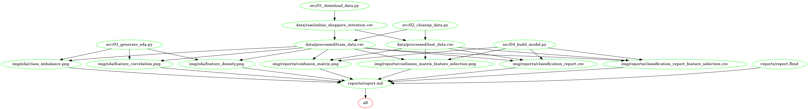

# Online Purchasing Intention Predictor
- Co-authors: Yazan Saleh, Mai Le, Tran Doan Khanh Vu, Jingjing Zhi

A data analysis project aiming to predict purchasing intentions of online shoppers.

## About
In this project, we compare 3 different algorithms with the aim of building a classification model to predict purchasing intentions of online shoppers given browser session data and pageview data. Given our dataset, random forest classifier was identified as the best model compared to support vector machine and logistic regression classifiers. Although the model performed relatively well in terms of accuracy with a score of 0.88, its performance was less robust when scored using `f1` metric. Specifically, the model had an `f1` score of 0.66 and mis-classified 376 observations, 131 of which were false negatives. The 131 incorrect classifications are significant as they represent potential sources of missed revenue for e-commerce businesses. Therefore, we recommend improving this model prior to deployment in the real-world.

The data set used in this project is the "Online Shoppers Purchasing Intention" dataset provided by the [Gözalan Group](http://www.gozalangroup.com.tr/) and used by Sakar, OC et al. in their 2018 analysis publsihed in [Neural Computing and Applications](https://link.springer.com/article/10.1007/s00521-018-3523-0)[@Sakar2019]. The data set was sourced from UCI's Machine Learning Repository [@Dua:2019] at this [link](https://archive.ics.uci.edu/ml/datasets/Online+Shoppers+Purchasing+Intention+Dataset). The specific file used for the analysis found [here](https://archive.ics.uci.edu/ml/machine-learning-databases/00468/online_shoppers_intention.csv). Each row in the data set contains pageview and session information belonging to a different visitor that browsed [Columbia](https://www.columbia.com.tr), an online e-commerce platform based in Turkey. Each row also contains the target class `REVENUE`, a boolean flag indicating whether that user session contributed to revenue or not. Pageview data includes the type of pages that the visitor browsed to and the duration spent on each page. Session information includes visitor-identifying data such as browser information, operating system information as well visitor location and type.

## Reports
The final report can be found [here](https://htmlpreview.github.io/?https://github.com/UBC-MDS/DSCI_522_group_31/blob/main/reports/report.html)

## Usage

To replicate this analysis, please follow these steps:

Step 1: Clone this GitHub repository

Step 2: Create and activate a conda envrionment using the `env.yaml` at the root of this project by running the following command at the root directory of the project. (Alternatively, you can manually install the dependencies listed in the `env.yaml` file)

```bash
conda env create --file env.yaml
conda activate online_shopping_prediction_env
```

Step 3: Run the following commands at the command line/terminal from the root directory of this project:

```bash
make all
```


To reset the project to a clean state and re-run the analysis, run the following command at the command line/terminal from the root directory of the project:

```bash
make clean
```

## Dependencies

Please see the project dependencies included in the root env.yaml file

## License

All Online Purchasing Intention Predictor materials are made available under the **Creative Commons Attribution 2.5 Canada License** ([CC BY 2.5 CA](https://creativecommons.org/licenses/by/2.5/ca/)).

# References
