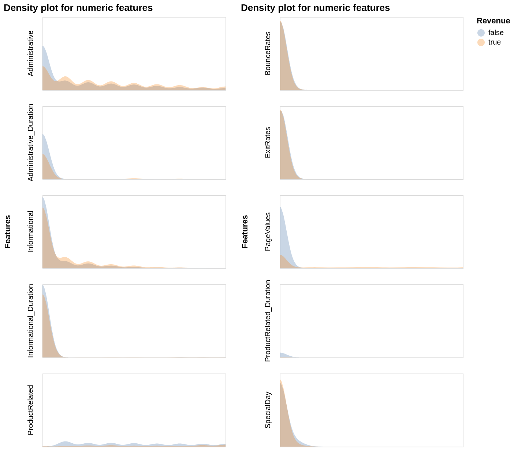
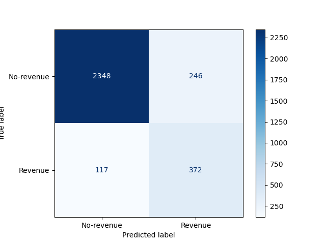
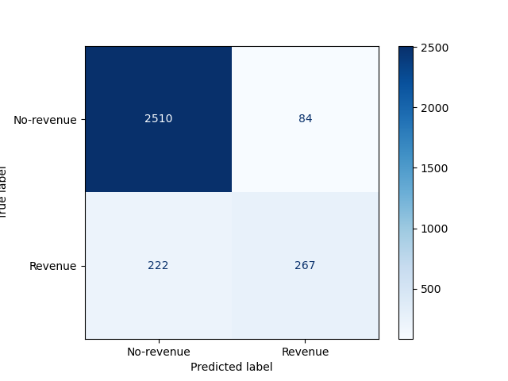

Predicting online shoppers’ purchasing intentions
================
Yazan Saleh
27/11/2020

-   [Summary](#summary)
-   [Introduction](#introduction)
-   [Methodology](#methodology)
    -   [Data](#data)
    -   [Analysis](#analysis)
-   [Results & Discussion](#results-discussion)
-   [References](#references)

## Summary

In this project, we compare 3 different algorithms with the aim of
building a classification model to predict purchasing intentions of
online shoppers given browser session data and pageview data. Given our
dataset, random forest classifier was identified as the best model
compared to support vector machine and logistic regression classifiers.
Although the model performed relatively well in terms of accuracy with a
score of 0.88, its performance was less robust when scored using `f1`
metric. Specifically, the model had an `f1` score of 0.66 and
mis-classified 376 observations, 131 of which were false negatives. The
131 incorrect classifications are significant as they represent
potential sources of missed revenue for e-commerce businesses.
Therefore, we recommend improving this model prior to deployment in the
real-world.

## Introduction

With the rising popularity of online shopping, particularly in the wake
of the 2020 coronavirus pandemic, there exists a strong growth
opportunity for businesses employing e-commerce solutions. While
increasing overall traffic to online stores is a critical first step,
higher traffic does not always convert into increased sales. Online
visitors may exit the site without making a purchase for a variety of
reasons including: loading times, website layout, pricing, and others.

In this project, we attempt to use machine learning to predict whether a
visitor of an online shopping website is intending on making a purchase
based on session data that looks at the pages they visit, the duration
of each visit, and the source of traffic among other factors.

Being able to predict purchasing intentions can be a valuable tool
because it could potentially allow businesses to implement measures to
better capture users with purchasing intentions and thus try to convert
them into actual revenue generators. For example, users with purchasing
intentions can be served with targeted content that aims to reduce
shopping cart abandonment. Predicting purchasing intentions can also be
useful for making more accurate forecasts about the business. A business
with a given portfolio of visitors may use the machine learning
algorithm to predict its revenue conversion rates which can be a
valuable metric in financial modeling.

## Methodology

### Data

The data set used in this project is the “Online Shoppers Purchasing
Intention” dataset provided by the [Gözalan
Group](http://www.gozalangroup.com.tr/) and used by Sakar et. al in
their analysis published in [Neural Computing and
Applications](https://link.springer.com/article/10.1007/s00521-018-3523-0)
(Sakar et al. 2019). The data set was sourced from UCI’s Machine
Learning Repository (Dua and Graff 2017) at this
[link](https://archive.ics.uci.edu/ml/datasets/Online+Shoppers+Purchasing+Intention+Dataset).
The specific file used for the analysis found
[here](https://archive.ics.uci.edu/ml/machine-learning-databases/00468/online_shoppers_intention.csv).
Each row in the data set contains pageview and session information
belonging to a different visitor that browsed
[Columbia](https://www.columbia.com.tr), an online e-commerce platform
based in Turkey. Each row also contains the target class `REVENUE`, a
boolean flag indicating whether that user session contributed to revenue
or not. Pageview data includes the type of pages that the visitor
browsed to and the duration spent on each page. Session information
includes visitor-identifying data such as browser information, operating
system information as well visitor location and type.

High level information about the dataset variables can be found below:

| Index | Variable                 | Description                                                                                                                                                    |
|-------|--------------------------|----------------------------------------------------------------------------------------------------------------------------------------------------------------|
| 1     | Administrative           | Number of administrative pages visited                                                                                                                         |
| 2     | Administrative\_Duration | Duration of time spent on administrative pages                                                                                                                 |
| 3     | Informational            | Number of informational pages visited                                                                                                                          |
| 4     | Informational\_Duration  | Duration of time spent on informational pages                                                                                                                  |
| 5     | ProductRelated           | Number of product related pages visited                                                                                                                        |
| 6     | ProductRelated\_Duration | Duration of time spent on informational pages                                                                                                                  |
| 7     | BounceRate               | The percentage of visitors who enter the site from that page and then leave without triggering any other requests to the analytics server during that session. |
| 8     | ExitRate                 | The percentage that were the last in the session over all pageviews to the page                                                                                |
| 9     | PageValues               | The average value for a web page that a user visited before completing a transaction.                                                                          |
| 10    | SpecialDay               | How close the site visiting time is to a special day/holiday                                                                                                   |
| 11    | Month                    | Month of visiting time                                                                                                                                         |
| 12    | OperatingSystem          | OS used by the visitor                                                                                                                                         |
| 13    | Browser                  | Internet browser used by the visitor                                                                                                                           |
| 14    | Region                   | Demographic region when the user accessing the site                                                                                                            |
| 15    | TrafficType              | From which source the visitor arrived at the site                                                                                                              |
| 16    | VisitorType              | Visitor type as “New Visitor,” “Returning Visitor,” and “Other”                                                                                                |
| 17    | Weekend                  | If the visiting day is during weekend                                                                                                                          |
| 18    | Revenue                  | Prediction target                                                                                                                                              |

**Table 1: Data set description**

Values of feature 1-6 are derived from the visited pages’ URL and
reflected in real time when a user takes any actions on the site. Values
of feature 7-9: come from metrics measured by “Google Analytics” for
each page on the site.

Among those features, there are some features that might be important to
predict the target: ‘ProductRelated\_Duration,’ ‘BounceRates,’
‘ExitRates,’ ‘PageValues,’ ‘Month,’ ‘TrafficType’ and ‘VisitorType.’

### Analysis

The dataset has class imbalance whereby there are many more observations
corresponding to visitors that do not end up contributing to revenue
(i.e. target `Revenue` class value is `False`) compared to the number of
observations corresponding to visitors that do end up contributing to
revenue (i.e. target `revenue` class value is `True`) (Figure 1). Class
imbalance will be dealt with by changing the training procedures of our
models and assigning `class_weight` to `balanced`.

<b>Figure.1 Class imbalance</b>

Considering this is a binary classification problem, several algorithms
can be well-suited to the task. In our study, we compared 3 different
models, namely, support-vector machine (SVM), logistic regression, and
random forest classifier in their ability to classify visitors as a
revenue generator, (i.e. intending to purchase) or not. Initially all
features included in the data sets were used to fit and score the
models. Hyperparameters of each model were chosen based on `f1` scores
following randomized search cross-validation. Specifically, we tuned the
regularization and kernel coefficient for SVM; the regularization
hyperparameter for logistic regression; and the number of estimators and
maximum depth parameters for random forest classifier. The number of
folds used in cross-validation was 10 for both hyperparameter
optimization and model selection.

After selecting the best model with the best hyperparameters, we reduced
the number of features by eliminating the non-important ones using
recursive feature elimination (RFE).

The analysis was performed using the Python programming language (Van
Rossum and Drake 2009) along with the following packages: Altair
(VanderPlas et al. 2018), docopt (de Jonge 2020), feather (McKinney
2019), knitr (Xie 2014), pandas (McKinney and others 2010), and
Scikit-learn (Pedregosa et al. 2011). The code used to conduct this
analysis can be found
[here](https://github.com/UBC-MDS/DSCI_522_group_31).

## Results & Discussion

Prior to fitting the model, we looked at how the distribution of each of
the features in the training set varies between the two classes (revenue
generator: orange, not a revenue generator: blue). This visualization
shows us overlapping in the distribution of features across the two
target classes, although their spreads differ in some cases (Figure 2).
As a result, we opted to include all features in the initial analysis
and subsequently try to use RFE to better guide us at feature selection.

<b>Figure.2 Density plots of numerical features by target class</b>

Following random search hyperparameter optimization and fitting on the
entire training dataset, random forest classifier with hyperparameters
`max_depth = 13` and `n_estimators = 65` was the best performing model
according to `f1` score. (Table 2)

| Model               | fit\_time | score\_time | test\_accuracy | test\_f1 | test\_recall |
|:--------------------|----------:|------------:|---------------:|---------:|-------------:|
| Logistic Regression |    0.0798 |      0.0108 |         0.8548 |   0.6149 |       0.7554 |
| Random Forest       |    4.4867 |      0.0645 |         0.8841 |   0.6709 |       0.7702 |
| SVC                 |    3.2779 |      0.2207 |         0.8714 |   0.6374 |       0.7364 |

**Table 2: Model selection result**

The model performance on the test set was less robust as `f1` score
dropped to 0.67 when considering our class of interest, presence of
revenue, as the positive class. Overall accuracy was relatively high at
0.88 (Table 3) although the model mis-classified 363 observations
consisting of 246 false positives and 117 false negatives as per the
confusion matrix shown below (Figure 3).

<b>Figure.3 Confusion Matrix before Feature Selection</b>

| Class        | precision |    recall |  f1-score |      support |
|:-------------|----------:|----------:|----------:|-------------:|
| No-revenue   | 0.9525355 | 0.9051658 | 0.9282467 | 2594.0000000 |
| Revenue      | 0.6019417 | 0.7607362 | 0.6720867 |  489.0000000 |
| accuracy     | 0.8822575 | 0.8822575 | 0.8822575 |    0.8822575 |
| macro avg    | 0.7772386 | 0.8329510 | 0.8001667 | 3083.0000000 |
| weighted avg | 0.8969272 | 0.8822575 | 0.8876167 | 3083.0000000 |

**Table 3: Classification report of the best model before applying
feature selection**

We used recursive feature elimination (RFE) to attempt to achieve better
classification performance and identify the most important features. RFE
retained 37/74 features after transformation which came from 10 features
out of the original 17 as being most important to the classification
problem. Nevertheless, fitting the model on the new dataset that
includes these features only did not significantly affect performance as
shown below (Table 4 & Figure 4).

<b>Figure.4 Confusion Matrix after Feature Selection</b>

| Class        | precision |    recall |  f1-score |      support |
|:-------------|----------:|----------:|----------:|-------------:|
| No-revenue   | 0.9187111 | 0.9672321 | 0.9423474 | 2594.0000000 |
| Revenue      | 0.7585227 | 0.5460123 | 0.6349584 |  489.0000000 |
| accuracy     | 0.9004217 | 0.9004217 | 0.9004217 |    0.9004217 |
| macro avg    | 0.8386169 | 0.7566222 | 0.7886529 | 3083.0000000 |
| weighted avg | 0.8933033 | 0.9004217 | 0.8935919 | 3083.0000000 |

**Table 4: Classification report of the best model after applying
feature selection**

In the context of the model’s applicability, false negatives can be
argued to be more detrimental than false positives as they represent
untapped potential revenue sources. Therefore, we should prefer a model
with higher recall (sensitivty) over one with higher precision, which
was the case here. Nevertheless, and given the non-small number of false
negatives, our model might need further refinement before implementation
in the real-world.

One way of improving this model would be to employ oversampling to
address the class imbalance problem. Although we attempted to address
class imbalance by adjusting the weights associated with the target
class, Sakar et. al were able to achieve much better `f1` scores using
oversampled data sets and with similar algorithms (namely SVC and random
forest) (Sakar et al. 2019). Further, we could use a different method to
identify the most important features for this classification problem and
compare performance to the recursive feature elimination method we
employed here. Sakar et. al feature selection results include some
features from the same dataset, such as `Product related` and
`Administrative`, that were not identified by our RFE search. This
indicates that visiting `Product related` and `Administrative` pages is
important to the classification algorithm although our model and current
feature selection methodology was not able to identify that.

# References

de Jonge, Edwin. 2020. *Docopt: Command-Line Interface Specification
Language*. <https://CRAN.R-project.org/package=docopt>.

Dua, Dheeru, and Casey Graff. 2017. “UCI Machine Learning Repository.”
University of California, Irvine, School of Information; Computer
Sciences. <http://archive.ics.uci.edu/ml>.

McKinney, Wes. 2019. *Feather: Simple Wrapper Library to the Apache
Arrow-Based Feather File Format*. <https://github.com/wesm/feather>.

McKinney, Wes, and others. 2010. “Data Structures for Statistical
Computing in Python.” In *Proceedings of the 9th Python in Science
Conference*, 445:51–56. Austin, TX.

Pedregosa, Fabian, Gaël Varoquaux, Alexandre Gramfort, Vincent Michel,
Bertrand Thirion, Olivier Grisel, Mathieu Blondel, et al. 2011.
“Scikit-Learn: Machine Learning in Python.” *Journal of Machine Learning
Research* 12 (Oct): 2825–30.

Sakar, C. Okan, S. Olcay Polat, Mete Katircioglu, and Yomi Kastro. 2019.
“Real-Time Prediction of Online Shoppers’ Purchasing Intention Using
Multilayer Perceptron and LSTM Recurrent Neural Networks.” *Neural
Computing and Applications* 31 (10): 6893–6908.
<https://doi.org/10.1007/s00521-018-3523-0>.

Van Rossum, Guido, and Fred L. Drake. 2009. *Python 3 Reference Manual*.
Scotts Valley, CA: CreateSpace.

VanderPlas, Jacob, Brian Granger, Jeffrey Heer, Dominik Moritz, Kanit
Wongsuphasawat, Arvind Satyanarayan, Eitan Lees, Ilia Timofeev, Ben
Welsh, and Scott Sievert. 2018. “Altair: Interactive Statistical
Visualizations for Python.” *Journal of Open Source Software* 3 (32):
1057.

Xie, Yihui. 2014. “Knitr: A Comprehensive Tool for Reproducible Research
in R.” In *Implementing Reproducible Computational Research*, edited by
Victoria Stodden, Friedrich Leisch, and Roger D. Peng. Chapman;
Hall/CRC. <http://www.crcpress.com/product/isbn/9781466561595>.

